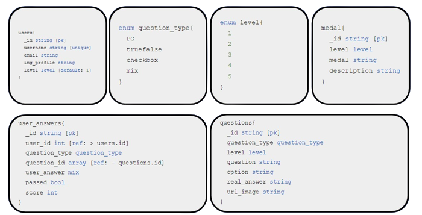
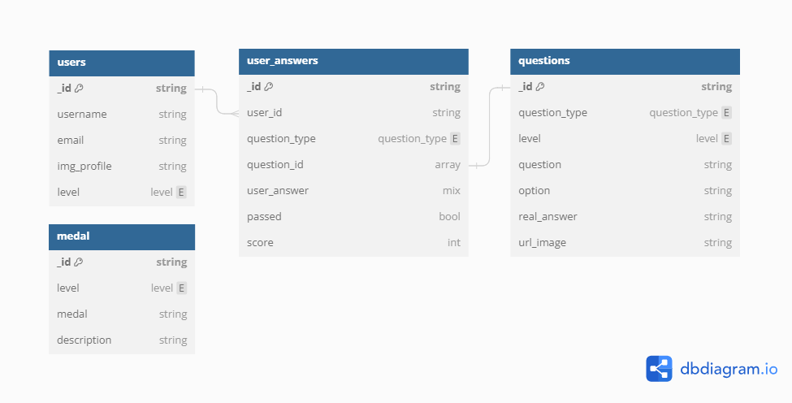

# Digiwise Backend

Final capstone project of Generasi Gigih 3.0 Fullstack Track

Link to the website : [Digiwise](https://digiwise.vercel.app/)

## **Tech Stack**

<div align="left">

  
 
</div>

## Table of Content
1. [Asset](#asset)
2. [Database structure](#database-structure)
3. [Endpoint](#endpoint)
4. [How to Run in Local](#how-to-run-in-local)
5. [How to run API swagger in local](#how-to-run-api-swagger-in-local)


## Asset
1. If you want to check this API in postman, you can import this asset into your postman https://drive.google.com/file/d/14H7tm-U2wV0Bjg-l5ZrelLD7cr82eqCO/view?usp=drive_link

2. Or if you want to check the API via swagger, you can follow the instructions below [How to run API swagger in local](#how-to-run-api-swagger-in-local)

## Database Structure




## Endpoint

### Question

1. Method POST `http://localhost:5000/questions`
2. Method GET `http://localhost:5000/questions/:id`
3. Method GET `http://localhost:5000/questions`

### User

#### Question

1. Method GET `http://localhost:5000/users/questions?level=2` to get question by level

#### Login Register

1. Method POST `http://localhost:5000/users/register` to register user
2. Method POST `http://localhost:5000/users/login` to login user

#### Answer User

1. Method POST `http://localhost:5000/users/answers` to send user answer

#### Data User

1. Method GET `http://localhost:5000/users` to get all user
1. Method GET `http://localhost:5000/users/:id` to get user by id

#### Medal User
1. Method Get `http://localhost:5000/users/medal` to get a medal according to the user's pass level

## How to Run in Local

1. Clone the repository to your local machine.
   ```bash
   git clone https://github.com/Digiwise-APP/backend-digiwise.git
   ```
2. Open a new terminal window and navigate to the backend directory
   ```bash
   cd backend-digiwise
   ```
3. Install the dependencies for the backend
   ```bash
   npm i
   ```
4. Start the backend server on port 5000
   ```bash
   nodemon index.js
   ```

## How to run API swagger in local
1. After you clone this repository, you can move on to other branch
    ```bash
   git checkout development
   ```
2. Do the command below to create a new container and run it
     ```bash
   docker-compose up -d
   ```
3. Run the application
     ```bash
   npm run start
   ```
4. Open in your browser to see the API documentation
     ```bash
   http://localhost:5000/api-docs/
   ```